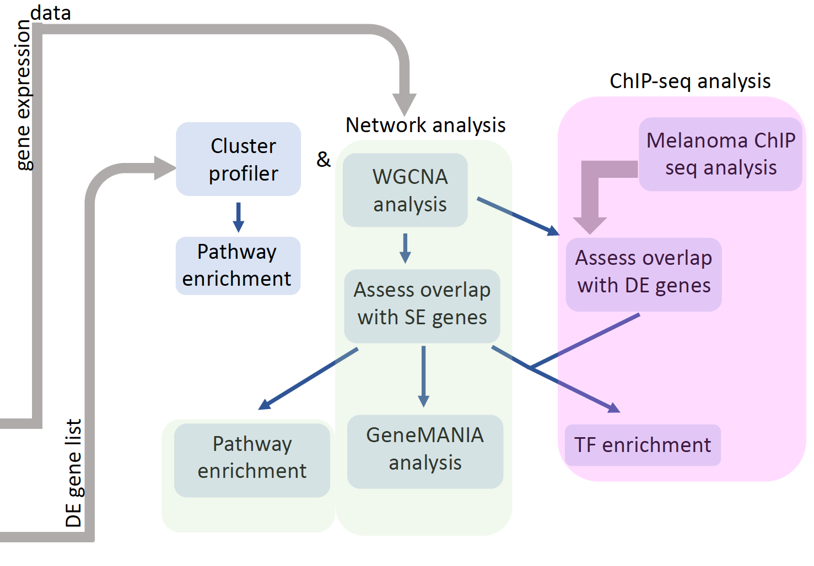

CPNA: Cancer progression analysis using network biology
-----------

Using a network biology platform that uses transcriptomic profiles in early and late stages of melanoma, the goal is to identify mechanisms that drives melanoma progression. We have performed a consensus network analysis of RNA-seq data from clinically re-grouped melanoma samples to identify gene co-expression networks that are conserved in early (stage 1) and late (stage 4/invasive) stage melanoma. Overlaying the fold-change information on co-expression networks revealed several coordinately up or down-regulated subnetworks that may play a critical role in cancer progression.

CPNA Workflow 
--------

  

 
License
--------
MIT license: https://opensource.org/licenses/MIT 
 
   

